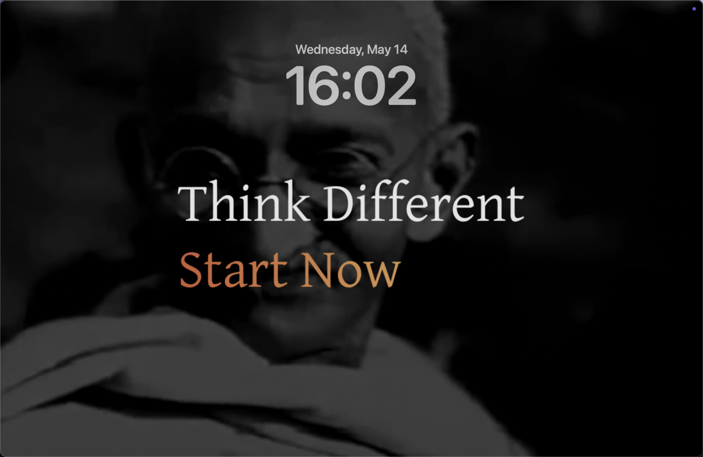

# Start Now Screensaver

**Draw inspiration from great minds every time you wake up your Mac**

[Preview on YouTube](https://www.youtube.com/watch?v=rpTPeSgN2ig)

[**I want this!**](https://ventuss.gumroad.com/l/startnow?utm_campaign=reddit-launch&utm_medium=posts&utm_source=reddit)

## Introduction

The power of habit is profound. When a default screensaver appears, we're often tempted to drift into YouTube and Instagram.

Your Mac, however, is a productivity companion—created by Steve Jobs to help you do exceptional work. Remember this purpose!

We've been inspired by countless visionaries: Gandhi, The Beatles, Hepburn, Churchill, Muhammad Ali...

This screensaver transforms your Mac's idle moments into a source of motivation with a simple yet powerful message:

> Think Different & Start Now

## Features

- **Inspiring Text**: Displays "Think Different" and dynamic "Start Now" series messages
- **Personalized Age Display**: Shows "in your XXs" based on your birth year
- **Elegant Gradient Text**: Beautiful animated text effects
- **Video Background**: Subtle video backdrop enhances the visual experience
- **Authentic Mac Screensaver**: Native .saver file format

## Inspiration Sources

- [Apple "Think Different" Campaign](https://www.youtube.com/watch?v=cpzvwkR1RYU)
- Start in November Image 

## System Requirements

- Mac with Apple Silicon (M-series chip)
- macOS 14.0+ (Sonoma)
- Xcode 15.0+ (for development)

## Best Practice

Set up Hot Corners to activate the screensaver instantly:
1. Go to Settings > Desktop & Dock > Hot Corners
2. Choose any corner to activate the screen saver
3. Whenever you step away from your Mac, simply move your cursor to that corner—this keeps your device both secure and inspiring

## Configuration Options

In the screensaver settings, you can configure:
- **Birth Year**: Customize the "in your XXs" display according to your age

## Development Guide

### Getting Started
- Open `Start Now.xcodeproj` in Xcode
- Press Shift + Command + K to clean the build cache
- Press Command + B to compile

### Useful Scripts
- `Script/clear_screensaver_cache.command`: Clears system cache for the screensaver
- `Script/alias.saver`: Quickly installs new .saver files

### Technical Implementation

#### Core Technologies
- **Objective-C**: Project implemented using the ScreenSaver framework
- **Core Animation**: Text gradient effects and animations via CALayer, CATextLayer, CAGradientLayer
- **AVFoundation**: Video background playback and control
- **Core Text**: Custom font loading and rendering
- **NSDistributedNotificationCenter**: Handling screensaver lifecycle events

#### Key Components
- **FontManager**: Custom font management and registration
- **Start_NowView**: Main view class, inherits from ScreenSaverView
- **Typing Animation System**: Implements typing and erasing effect animations
- **Configuration Form**: User settings interface implemented with NSWindow

#### Architecture
- **Layered Design**: Video background layer, semi-transparent mask layer, text rendering layer
- **Responsive Layout**: Automatically adapts to fullscreen and preview window dimensions
- **Persistent Configuration**: User settings stored using NSUserDefaults
- **Memory Optimization**: Fixes for memory leaks in macOS Sonoma

#### File Structure
- **Start_NowView.h/m**: Main implementation files
- **Resources/**: Contains Gentium font files and background video
- **thumbnail.png/thumbnail@2x.png**: Screensaver thumbnails

## License

This work is licensed under a [Creative Commons Attribution-NonCommercial-NoDerivatives 4.0 International License](https://creativecommons.org/licenses/by-nc-nd/4.0/) (CC BY-NC-ND 4.0).

You are free to:
- **Share** — copy and redistribute the material in any medium or format for personal use

Under the following terms:
- **Attribution** — You must give appropriate credit, provide a link to the license, and indicate if changes were made.
- **NonCommercial** — You may not use the material for commercial purposes.
- **NoDerivatives** — If you remix, transform, or build upon the material, you may not distribute the modified material.